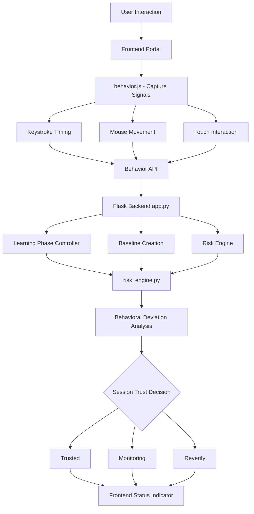
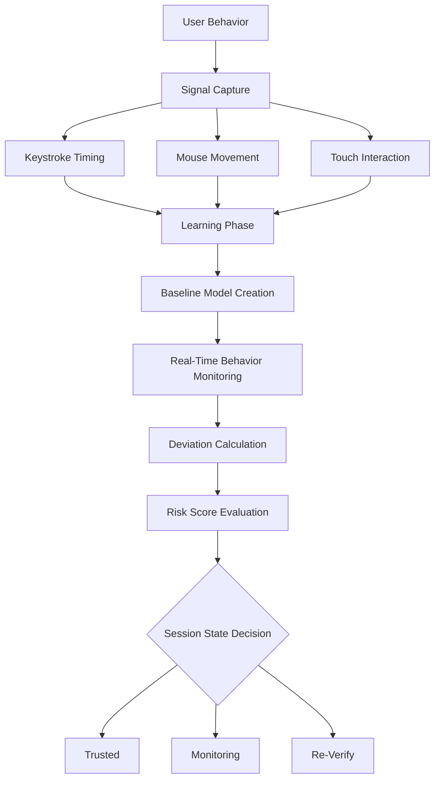

# Zero Trust Behavioral Authentication Portal

A web-based **adaptive authentication system** that continuously verifies user identity using behavioral biometrics such as typing rhythm, mouse movement, and touch interaction patterns.

Traditional authentication systems verify identity only during login.  
This system implements **continuous authentication**, meaning the user's behavior is monitored throughout the entire session.

If the behavior deviates significantly from the learned pattern, the system can trigger additional verification.

---

# Project Overview

This project demonstrates an implementation of **Zero Trust Architecture (ZTA)** principles in a web portal.

Instead of trusting a user after login, the system continuously evaluates behavioral signals to determine whether the current session still matches the authenticated user.

A behavioral baseline is learned during a short **learning phase**, after which real-time interaction data is compared to that baseline to detect anomalies.

---

# Key Features

## Continuous Behavioral Authentication

The system continuously verifies identity during the session instead of relying only on login credentials.


## Multi-Signal Behavioral Monitoring

### Desktop Signals
- Keystroke timing rhythm
- Mouse movement speed

### Mobile Signals
- Touch interval rhythm
- Swipe movement distance


## Learning Phase

After login, the system enters a short learning period where the baseline behavioral profile is generated.


## Adaptive Risk Evaluation

User behavior is continuously evaluated and the session is classified as:

- **Trusted**
- **Monitoring**
- **Re-Verification Required**


## Device-Aware Authentication

The model automatically adapts to both **desktop and mobile interaction styles**.


## Real-Time Monitoring

Behavioral signals are streamed to the backend where risk analysis is performed.

---

# System Architecture

This diagram illustrates the system architecture of the Zero Trust behavioral authentication portal. User interactions are captured on the frontend, transmitted to the backend for processing, and analyzed  by the risk engine to continuously evaluate session trust.


---

## Behavioral Authentication Pipeline

This pipeline shows how behavioral signals are collected, modeled during a learning phase, and continuously analyzed to detect deviations from the user's baseline interaction pattern.
The resulting risk score determines whether the session remains trusted, monitored, or requires re-verification.



---

# Behavioral Baseline Model

During the learning phase, the system calculates average behavioral metrics.

Example baseline structure:

```json
{
  "keystroke_avg": 144.42,
  "mouse_avg": 6.19,
  "touch_avg": 0,
  "touch_distance": 0
}
```

Only signals observed during the learning phase are used in risk evaluation to avoid false alerts.

---

# Risk Evaluation

Behavioral deviation from the baseline is calculated to determine session trust.

Conceptually:

```
risk_score = deviation(current_behavior, baseline)
```

Session state transitions:

```
Trusted → Monitoring → Re-Verify
```

---

# Technology Stack

## Backend
- Python
- Flask

## Frontend
- JavaScript
- HTML
- CSS

## Behavioral Modeling
- NumPy
- Real-time behavioral signal processing

## Deployment
- Render Cloud Platform

---

# Testing the System

1. Open the deployed portal
2. Log in to start a session
3. Interact normally during the learning phase
4. Continue interacting normally to maintain a trusted session
5. Significant behavioral deviation may trigger monitoring or re-verification

Debug endpoint:

```
/debug-baseline
```

This endpoint displays the learned behavioral baseline.

---

# Security Concept

This project demonstrates key **Zero Trust security principles**:

- Never trust, always verify
- Continuous behavioral authentication
- Session-based risk evaluation
- Behavioral anomaly detection

---

# Future Improvements

Possible extensions include:

- Adaptive trust scoring
- Persistent baseline storage
- Multi-user behavioral profiles
- Behavioral drift adaptation
- ML-based behavioral anomaly detection
- Trust score visualization dashboard

---
